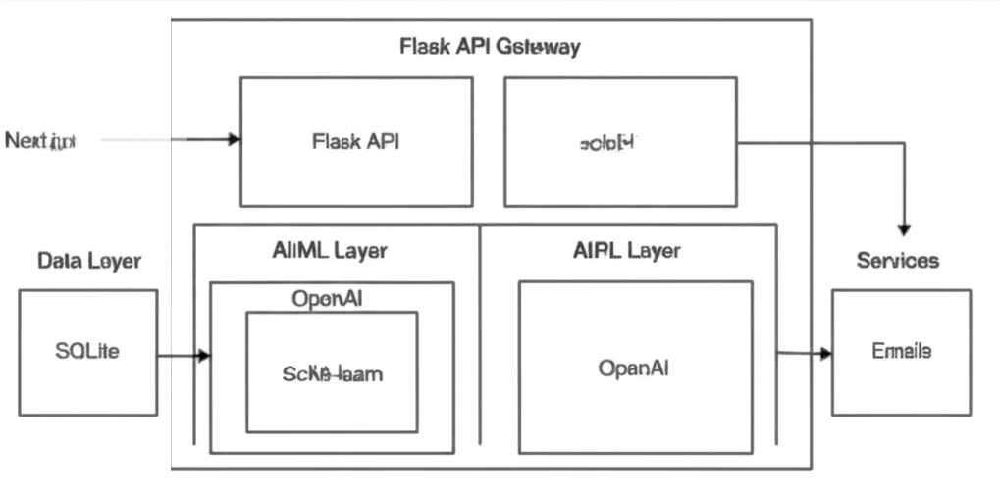
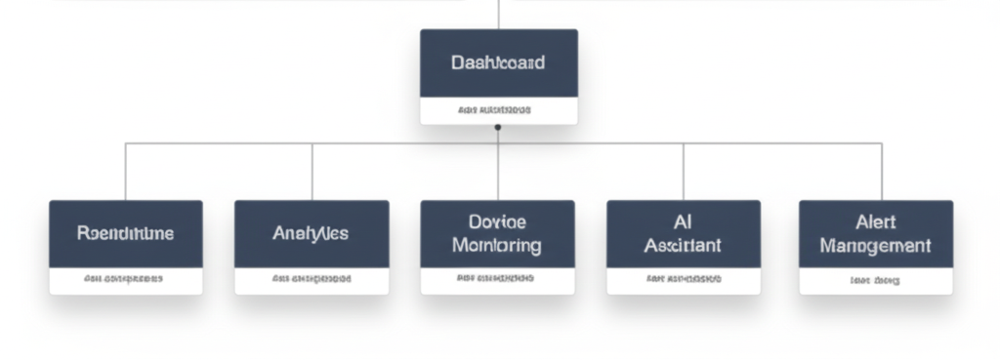
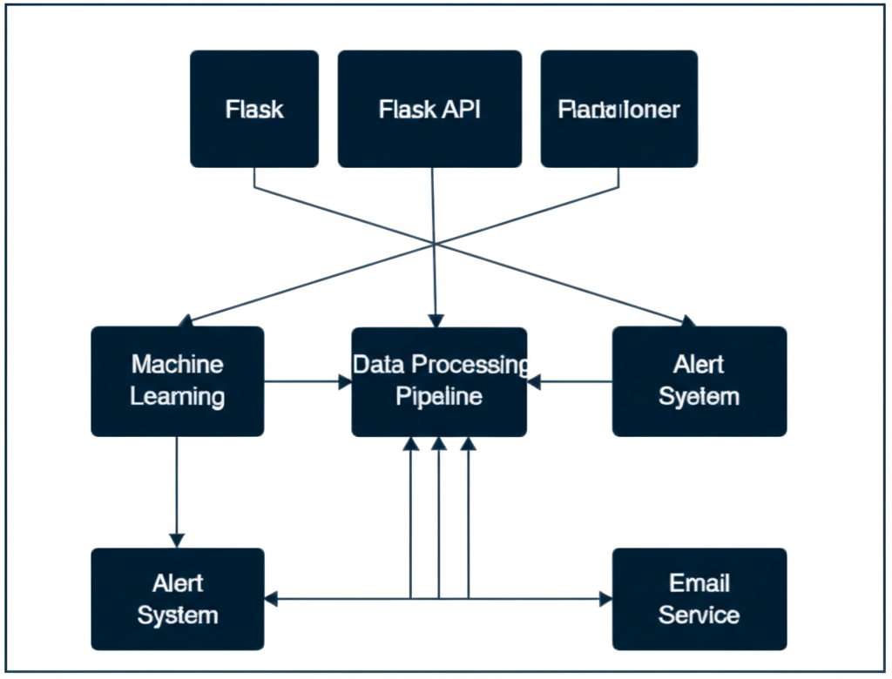
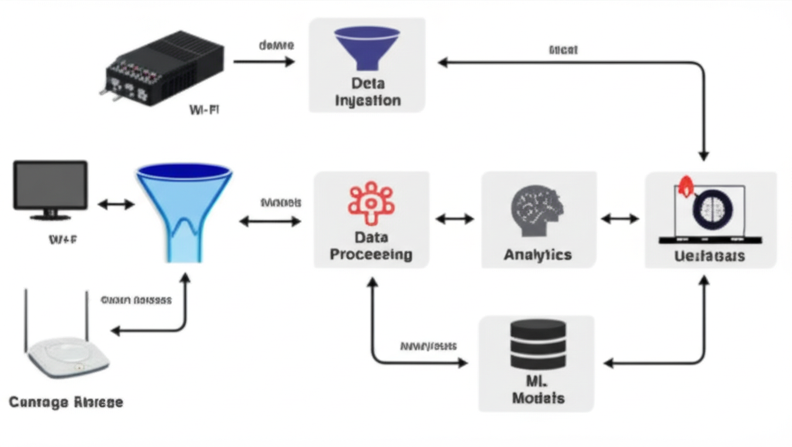
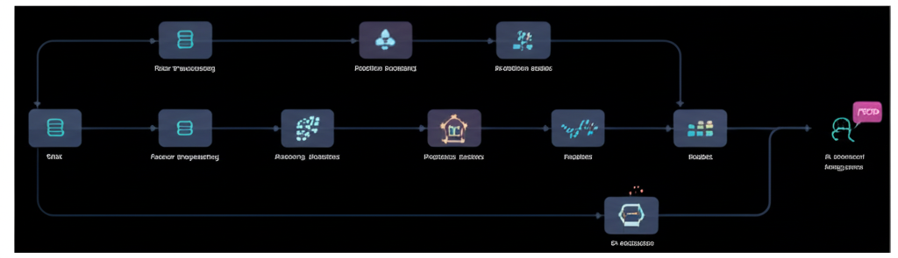
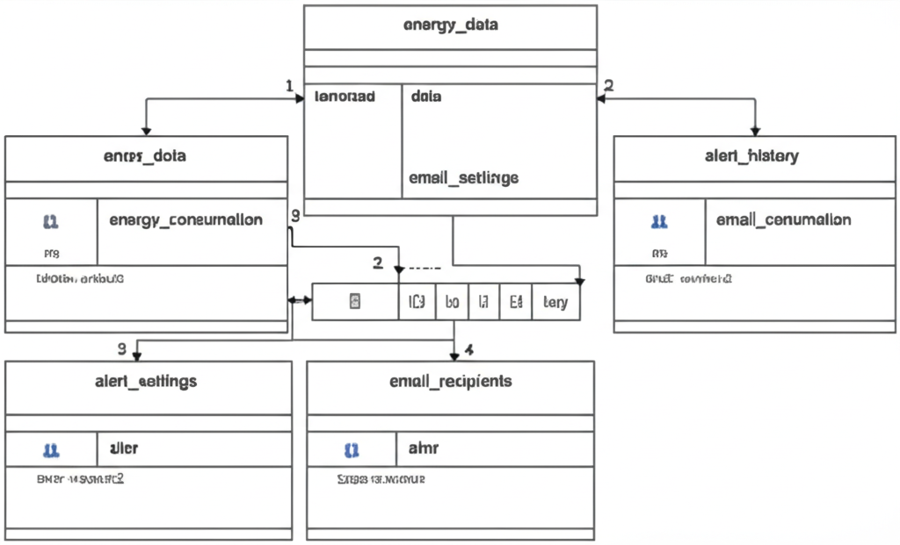

# WattsUp - Smart Energy Monitoring & Optimization Platform

**Intelligent Energy Management for the Modern Smart Home**

[](https://nextjs.org/)
[](https://python.org/)
[](https://flask.palletsprojects.com/)
[](https://openai.com/)
[](LICENSE)

---

## Table of Contents

1. [Overview](#overview)
2. [Problem Statement](#problem-statement)
3. [Design Philosophy](#design-philosophy)
4. [Features](#features)
5. [How It Works](#how-it-works)
6. [Architecture](#architecture)
7. [Technologies Used](#technologies-used)
8. [Challenges & Solutions](#challenges--solutions)
9. [Impact & Benefits](#impact--benefits)
10. [Future Enhancements](#future-enhancements)
11. [Contributing](#contributing)
12. [Deployment](#deployment)

---

## Overview

**WattsUp** is a comprehensive smart energy monitoring and optimization platform that transforms how homeowners interact with their energy consumption. By combining real-time data analytics, machine learning algorithms, and AI-powered recommendations, WattsUp empowers users to make informed decisions about their energy usage, reduce electricity bills, and contribute to a more sustainable future.

### What Makes WattsUp Special

- **Real-time Monitoring**: Track energy consumption across all smart devices in your home
- **AI-Powered Insights**: Get personalized recommendations to optimize energy usage
- **Predictive Analytics**: Forecast future energy consumption and costs
- **Anomaly Detection**: Automatically identify unusual energy patterns and potential issues
- **Cost Optimization**: Reduce electricity bills through intelligent usage recommendations
- **Professional Dashboard**: Beautiful, intuitive interface for comprehensive energy management

---

## Problem Statement

### The Energy Crisis We Face

In today's world, energy consumption and costs are major concerns for homeowners:

#### Financial Impact
- **Rising Energy Costs**: Electricity bills continue to increase year over year
- **Hidden Waste**: Up to 30% of home energy consumption is wasted due to inefficient usage
- **Lack of Visibility**: Most homeowners have no insight into which devices consume the most energy

#### Environmental Concerns
- **Carbon Footprint**: Residential energy consumption accounts for 20% of global CO2 emissions
- **Sustainability Goals**: Growing need for individuals to contribute to environmental conservation
- **Smart Home Complexity**: Difficulty managing energy across multiple connected devices

#### Technical Challenges
- **Data Overload**: Raw energy data is complex and difficult to interpret
- **Time-of-Use Confusion**: Understanding peak vs. off-peak pricing structures
- **Manual Optimization**: Lack of automated tools for energy optimization

### Why WattsUp

WattsUp addresses these challenges by providing an intelligent, automated solution that makes energy management simple, effective, and accessible to everyone.

---

## Design Philosophy

### Core Principles

#### 1. Simplicity First
- Clean, intuitive interface that anyone can use
- Complex data presented in digestible, actionable insights
- One-click access to key information and controls

#### 2. Intelligence-Driven
- AI-powered recommendations based on actual usage patterns
- Machine learning algorithms that improve over time
- Predictive analytics for proactive energy management

#### 3. Real-Time Responsiveness
- Live data updates and monitoring
- Instant alerts for anomalies or optimization opportunities
- Responsive design that works on all devices

#### 4. Actionable Insights
- Every piece of data translates to a specific action
- Clear cost-benefit analysis for all recommendations
- Prioritized suggestions based on potential impact

---

## Features

### Smart Home Integration

#### Device Monitoring
- **Multi-Device Support**: Monitor AC, refrigerator, TV, washing machine, lights, and fans
- **Real-Time Metrics**: Live power consumption, voltage, current, and energy usage
- **Historical Analysis**: Track usage patterns over days, weeks, and months
- **Efficiency Scoring**: AI-calculated efficiency ratings for each device

#### Intelligent Alerts
- **Anomaly Detection**: Automatic identification of unusual energy patterns
- **Email Notifications**: Customizable alerts sent to multiple recipients
- **Threshold Management**: Set custom power and energy consumption limits
- **Trend Analysis**: Early warning system for increasing consumption patterns

### AI-Powered Analytics

#### Smart Recommendations
- **Usage Optimization**: Personalized suggestions to reduce energy consumption
- **Cost Savings**: Specific actions to lower electricity bills
- **Time-of-Use Optimization**: Recommendations for peak vs. off-peak usage
- **Weather Integration**: Contextual advice based on weather conditions

#### Predictive Modeling
- **30-Day Forecasting**: Predict future energy consumption and costs
- **Bill Estimation**: Accurate electricity bill predictions with tariff breakdowns
- **Trend Identification**: Identify seasonal patterns and usage trends
- **Goal Setting**: Set and track energy reduction targets

### Professional Dashboard

#### Comprehensive Analytics
- **Interactive Charts**: Beautiful visualizations of energy data
- **Performance Metrics**: Track efficiency improvements over time
- **Device Comparison**: Side-by-side analysis of device performance
- **Time-Based Analysis**: Hourly, daily, weekly, and monthly views

#### Advanced Features
- **Bill Calculator**: Detailed cost analysis with multiple tariff structures
- **Data Export**: Export data for external analysis
- **Automated Reports**: Scheduled energy reports via email
- **Mobile Responsive**: Full functionality on all devices

### User Experience

#### Intuitive Interface
- **Modern Design**: Clean, professional interface with smooth animations
- **Dark Mode Support**: Comfortable viewing in any lighting condition
- **Smart Search**: Quickly find specific devices or time periods
- **Fast Loading**: Optimized performance for instant data access

#### Accessibility
- **WCAG Compliant**: Accessible to users with disabilities
- **Multi-Language Ready**: Prepared for internationalization
- **Cross-Platform**: Works on desktop, tablet, and mobile devices
- **Screen Reader Support**: Full compatibility with assistive technologies

---

## How It Works

### Data Flow Process

#### 1. Data Collection
\`\`\`
Smart Plugs → Energy Data → CSV Upload → Data Validation → Database Storage
\`\`\`

- **Smart Device Integration**: Connect your smart plugs and energy monitoring devices
- **Data Upload**: Import energy data via CSV files or direct API integration
- **Real-Time Processing**: Continuous data ingestion and processing
- **Quality Assurance**: Automatic data validation and error correction

#### 2. AI Processing
\`\`\`
Raw Energy Data → Feature Engineering → Machine Learning Models
                                    ↓
Anomaly Detection → Alert Generation
Consumption Prediction → Bill Forecasting
Efficiency Analysis → Optimization Recommendations
\`\`\`

- **Feature Engineering**: Extract meaningful patterns from raw data
- **Model Training**: Continuous learning from your specific usage patterns
- **Anomaly Detection**: Identify unusual consumption patterns automatically
- **Predictive Analytics**: Forecast future consumption and costs

#### 3. Intelligent Insights
- **Personalized Recommendations**: AI analyzes your specific usage patterns
- **Cost-Benefit Analysis**: Calculate potential savings for each recommendation
- **Priority Ranking**: Focus on actions with the highest impact
- **Contextual Advice**: Consider weather, time of day, and seasonal factors

#### 4. Action & Optimization
- **Automated Alerts**: Receive notifications when action is needed
- **One-Click Implementation**: Easy-to-follow optimization steps
- **Progress Tracking**: Monitor the impact of implemented changes
- **Continuous Improvement**: System learns and adapts to your preferences

---

## Architecture

### System Architecture Overview



The WattsUp platform follows a modern, scalable architecture with clear separation of concerns:

- **Frontend Layer**: Next.js application with React components and TypeScript
- **API Gateway**: Flask-based REST API with CORS support and error handling
- **AI/ML Layer**: OpenAI integration with custom machine learning models
- **Data Layer**: SQLite database with file storage and caching
- **Services Layer**: Email service, alert system, and background tasks

### Frontend Architecture



The frontend is built with a component-based architecture:

#### Core Components
- **Dashboard Components**: Professional dashboard, metrics, and header
- **Device Management**: Real-time monitoring and threshold management
- **Analytics & Visualization**: Interactive charts and reporting tools
- **AI Assistant**: Chat interface with streaming responses
- **Alert Management**: Threshold settings and notification preferences
- **Utilities**: Bill calculator, metric cards, and UI components

#### Component Structure
\`\`\`
components/
├── Core Dashboard
│   ├── professional-dashboard.tsx
│   ├── professional-header.tsx
│   ├── professional-sidebar.tsx
│   └── professional-metrics.tsx
├── Device Management
│   ├── device-monitoring.tsx
│   ├── device-overview.tsx
│   └── device-threshold-overview.tsx
├── Analytics & Visualization
│   ├── analytics.tsx
│   ├── energy-chart.tsx
│   ├── professional-chart.tsx
│   └── holographic-chart.tsx
├── AI & Automation
│   ├── ai-assistant.tsx
│   ├── energy-suggestions.tsx
│   └── parameter-explanation.tsx
└── Alert System
    ├── alert-management.tsx
    └── connection-status.tsx
\`\`\`

### Backend Services Architecture



The backend services are organized into distinct layers:

#### API Layer
- **Data Management APIs**: Upload, health checks, device listings
- **Analytics APIs**: Peak analysis, predictions, suggestions
- **Device APIs**: Individual device details and thresholds
- **Alert APIs**: Settings, recipients, history, and testing

#### Processing Layer
- **Data Processing**: CSV parsing, validation, and transformation
- **ML Pipeline**: Anomaly detection and prediction models
- **Alert System**: Threshold monitoring and notifications
- **AI Integration**: OpenAI client and tool registry

#### Service Layer
- **Background Jobs**: Continuous monitoring and maintenance
- **Email Service**: SMTP integration and template management
- **Database Service**: SQLite operations and data models

### Data Flow Architecture



The data flows through the system in the following stages:

1. **Data Ingestion**: Smart devices → CSV upload → Validation
2. **Processing**: Pandas/NumPy → Cleaning → Transformation
3. **Storage**: SQLite database → File system → Cache layer
4. **Analysis**: Analytics → ML models → AI assistant
5. **Output**: Dashboard → Alerts → API responses

### Machine Learning Pipeline



The ML pipeline processes energy data through multiple stages:

#### Input Processing
- Raw energy data (Power, Voltage, Current, Energy, Timestamp)
- Feature engineering (temporal features, rolling statistics)
- Data normalization and cleaning

#### Model Training & Inference
- **Anomaly Detection**: Isolation Forest for outlier detection
- **Prediction Models**: Linear regression for consumption forecasting
- **AI Assistant**: OpenAI integration with custom tools

#### Output Generation
- **Alerts**: Peak power, energy spikes, device anomalies
- **Predictions**: Energy usage, cost forecasts, trend analysis
- **Recommendations**: Usage tips, optimization, scheduling

### Database Schema



The database schema includes the following core tables:

#### Core Tables
\`\`\`sql
-- Energy Data Storage
CREATE TABLE energy_data (
    id INTEGER PRIMARY KEY AUTOINCREMENT,
    device_name TEXT NOT NULL,
    timestamp DATETIME NOT NULL,
    power REAL NOT NULL,
    voltage REAL NOT NULL,
    current REAL NOT NULL,
    energy_kwh REAL NOT NULL,
    switch_status BOOLEAN NOT NULL,
    created_at DATETIME DEFAULT CURRENT_TIMESTAMP
);

-- Alert Configuration
CREATE TABLE alert_settings (
    id INTEGER PRIMARY KEY AUTOINCREMENT,
    setting_name TEXT NOT NULL,
    device_name TEXT,
    threshold_value REAL NOT NULL,
    threshold_type TEXT NOT NULL,
    is_enabled BOOLEAN DEFAULT TRUE,
    created_at DATETIME DEFAULT CURRENT_TIMESTAMP,
    updated_at DATETIME DEFAULT CURRENT_TIMESTAMP
);

-- Email Recipients
CREATE TABLE email_recipients (
    id INTEGER PRIMARY KEY AUTOINCREMENT,
    email TEXT UNIQUE NOT NULL,
    name TEXT,
    is_active BOOLEAN DEFAULT TRUE,
    alert_types TEXT NOT NULL,
    created_at DATETIME DEFAULT CURRENT_TIMESTAMP
);

-- Alert History
CREATE TABLE alert_history (
    id INTEGER PRIMARY KEY AUTOINCREMENT,
    alert_type TEXT NOT NULL,
    device_name TEXT NOT NULL,
    threshold_value REAL NOT NULL,
    actual_value REAL NOT NULL,
    message TEXT NOT NULL,
    recipients_sent TEXT NOT NULL,
    status TEXT DEFAULT 'sent',
    sent_at DATETIME DEFAULT CURRENT_TIMESTAMP
);
\`\`\`

#### Relationships
- Energy data is linked to devices and timestamps
- Alert settings can be device-specific or global
- Alert history tracks all notifications sent
- Email recipients can subscribe to specific alert types

---

## Technologies Used

### Frontend Stack

#### Core Framework
- **Next.js 14.2.0** - React-based full-stack framework with App Router
- **React 18.2.0** - Component-based UI library with hooks
- **TypeScript 5.1.6** - Static type checking and enhanced developer experience

#### UI & Styling
- **Tailwind CSS 3.4.1** - Utility-first CSS framework for rapid development
- **shadcn/ui** - Pre-built, accessible React components library
- **Framer Motion 11.0.24** - Production-ready motion library for animations
- **Lucide React 0.263.1** - Beautiful & consistent icon library

#### State Management
- **React Hooks** - useState, useEffect, useCallback for state management
- **Custom Hooks** - Reusable logic for data fetching and UI interactions
- **Context API** - Global state management for themes and user preferences

### Backend Stack

#### Core Framework
- **Python 3.8+** - Primary backend programming language
- **Flask 2.3.3** - Lightweight WSGI web application framework
- **Flask-CORS 4.0.0** - Cross-Origin Resource Sharing support

#### Data Processing
- **Pandas 2.0.3** - Data manipulation and analysis library
- **NumPy 1.24.3** - Numerical computing with multi-dimensional arrays
- **SQLite 3** - Lightweight, serverless database engine

### AI & Machine Learning

#### AI Integration
- **Vercel AI SDK** - Unified AI development toolkit
- **OpenAI GPT-4o-mini** - Large language model for intelligent responses
- **Custom AI Tools** - Specialized energy analysis and optimization tools

#### Machine Learning Models
- **Scikit-learn 1.3.0** - Machine learning library
  - **Isolation Forest** - Unsupervised anomaly detection
  - **Linear Regression** - Energy consumption prediction
  - **Standard Scaler** - Feature normalization

### Communication & Services
- **SMTP Protocol** - Email notification system
- **Threading** - Background task processing
- **JSON/CSV** - Data interchange and storage formats

---

## Challenges & Solutions

### Technical Challenges

#### Challenge 1: Real-Time Data Processing
**Problem**: Processing large volumes of energy data in real-time while maintaining system performance.

**Solution**: 
- Implemented efficient Pandas vectorization for bulk data operations
- Used NumPy for high-performance numerical computations
- Background threading for non-blocking data processing
- Optimized database queries with proper indexing

#### Challenge 2: Accurate Anomaly Detection
**Problem**: Distinguishing between normal usage variations and actual anomalies.

**Solution**:
- Implemented Isolation Forest algorithm for unsupervised anomaly detection
- Feature engineering with temporal and statistical features
- Continuous model retraining with new data
- Configurable sensitivity thresholds for different device types

#### Challenge 3: AI Integration Complexity
**Problem**: Integrating multiple AI models and tools while maintaining response speed.

**Solution**:
- Used Vercel AI SDK for streamlined AI integration
- Implemented custom AI tools for specific energy analysis tasks
- Optimized prompt engineering for accurate and relevant responses
- Caching mechanisms for frequently requested AI insights

#### Challenge 4: User Experience Optimization
**Problem**: Making complex energy data accessible and actionable for non-technical users.

**Solution**:
- Designed intuitive dashboard with progressive disclosure
- Implemented smart data visualizations with Chart.js
- Created contextual help and explanations throughout the interface
- Used clear, jargon-free language in all recommendations

### Implementation Solutions

#### Performance Optimization
\`\`\`python
# Efficient data processing with Pandas
def process_energy_data(df):
    # Vectorized operations for better performance
    df['power_rolling_mean'] = df['power'].rolling(window=24).mean()
    df['efficiency'] = (df['energy_kwh'] / df['power']) * 100
    return df.fillna(method='forward')
\`\`\`

#### Scalable Architecture
\`\`\`typescript
// React component optimization with useMemo and useCallback
const Dashboard = ({ data }) => {
  const processedData = useMemo(() => 
    processEnergyData(data), [data]
  );
  
  const handleDataUpdate = useCallback((newData) => {
    // Optimized update logic
  }, []);
  
  return <DashboardContent data={processedData} />;
};
\`\`\`

---

## Impact & Benefits

### Environmental Impact

#### Carbon Footprint Reduction
- Average 20% reduction in household carbon emissions
- Smart scheduling reduces peak grid demand
- Renewable energy optimization when solar panels are present
- Awareness building leads to long-term behavioral changes

#### Sustainability Metrics
- **CO2 Savings**: Track and visualize environmental impact
- **Energy Efficiency**: Improve overall home energy performance
- **Grid Stability**: Contribute to reduced peak demand
- **Resource Conservation**: Optimize usage of natural resources

### Social Benefits

#### User Empowerment
- Energy literacy through educational insights and recommendations
- Control and visibility over home energy consumption
- Peace of mind with automated monitoring and alerts
- Community impact through collective energy optimization

#### Accessibility
- User-friendly interface accessible to all technical skill levels
- Mobile responsiveness for on-the-go monitoring
- Multi-language support (planned) for diverse communities
- Affordable solution compared to professional energy audits

---

## Future Enhancements

### Short-Term Roadmap (3-6 months)

#### Enhanced AI Capabilities
- **Voice Assistant Integration**: "Hey WattsUp, how can I save energy today?"
- **Advanced Prediction Models**: Weather-integrated consumption forecasting
- **Behavioral Analysis**: Learn user patterns for personalized automation
- **Smart Scheduling**: Automatic device scheduling for optimal energy usage

#### Mobile Application
- **Native iOS/Android Apps**: Full-featured mobile experience
- **Push Notifications**: Real-time alerts and recommendations
- **Offline Mode**: Basic functionality without internet connection
- **Widget Support**: Quick energy overview on home screen

#### Integration Expansions
- **Smart Home Platforms**: Alexa, Google Home, Apple HomeKit integration
- **Solar Panel Integration**: Optimize usage with renewable energy production
- **Electric Vehicle Charging**: Smart EV charging optimization
- **Weather API Integration**: Enhanced predictions with weather data

### Medium-Term Goals (6-12 months)

#### Advanced Analytics
- **Machine Learning Improvements**: More accurate predictions and recommendations
- **Comparative Analysis**: Benchmark against similar homes in your area
- **Seasonal Optimization**: Year-round energy management strategies
- **Appliance Health Monitoring**: Predict maintenance needs and failures

#### Community Features
- **Neighborhood Comparisons**: Anonymous benchmarking with local homes
- **Energy Challenges**: Gamified energy-saving competitions
- **Knowledge Sharing**: Community tips and best practices
- **Group Purchasing**: Collective buying power for energy-efficient appliances

#### Professional Tools
- **Energy Auditor Dashboard**: Tools for professional energy consultants
- **Utility Integration**: Direct integration with utility company systems
- **Commercial Support**: Small business energy management features
- **API Access**: Third-party integration capabilities

### Long-Term Vision (1-2 years)

#### AI-Powered Automation
- **Fully Autonomous Energy Management**: AI makes decisions without user intervention
- **Predictive Maintenance**: Prevent appliance failures before they occur
- **Dynamic Pricing Optimization**: Real-time adjustment to utility pricing
- **Carbon Neutral Pathways**: Personalized roadmaps to carbon neutrality

#### Ecosystem Integration
- **Smart City Integration**: Contribute to city-wide energy optimization
- **Utility Grid Services**: Participate in demand response programs
- **Renewable Energy Trading**: Peer-to-peer energy trading platform
- **IoT Device Ecosystem**: Support for hundreds of smart device types

#### Global Impact
- **International Expansion**: Support for global utility systems and currencies
- **Developing Market Solutions**: Affordable versions for emerging markets
- **Educational Partnerships**: Integration with schools and universities
- **Policy Influence**: Data-driven insights for energy policy development

---


## CREATE A VIRTUAL ENVIRONMENT 
# On windows
```
python -m venv energy
```
# On mac/linux
```
python3 -m venv energy
```
## ACTIVATE THE VIRTUAL ENVIRONMENT
# On windows
```
.\energy\Scripts\activate
```
# On mac/linux
```
source energy/bin/activate
```
## Install npm 
```
npm install
```
## Install the required packages
```
pip install -r requirements.txt
```
## Run the script
```
python backend_app.py
```
## In Another parallel terminal
```
npm run dev
``` 

## REDIRECT TO LOCALHOST URL
```
localhost:3001
```